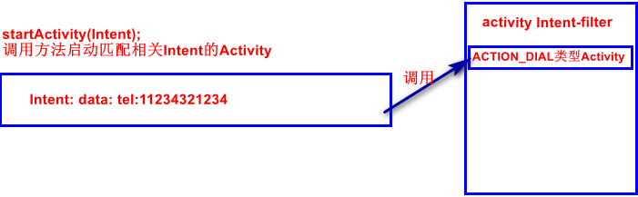

[TOC]

# Intent概述

1. 是对 一次运行的操作的抽象描述, 包括操作的动作, 数据, 即附加数据.
2. Android根据Intent的描述, 负责找到对应的组件, 并完成组件的调用.
3. Intent起到媒介的作用, 专门提供主键之间的相互调用之间的信息, 实现调用者与被调用者相互解耦.



# Intent的主要构成

> 1. Intent封装了很多的信息, Intent是用属性保存调用的Activity的信息;
> 2. 程序通过Intent对象的属性值, 查找符合的Intent, 即\<Activity\>标签所配置的属性.(系统会根据AndroidManifest.xml文件, 将所有的程序Activity生成一张表, 从而使用Intent特征去匹配合适的Activity);

## Component(name组件名)

1. 指定组件的名称, 他需要构建一个ComponentName对象作为Intent的属性;
2. 如果配置了此属性, 那么就会启动指定的主键.

```java
//<<<<<<<<<<<<<<<<<<<<<ComponentName构造函数
  /**
     * Create a new component identifier from a Context and Class object.
     *
     * @param pkg A Context for the package implementing the component, from
     * which the actual package name will be retrieved.
     * @param cls The Class object of the desired component, from which the
     * actual class name will be retrieved.
     */
    public ComponentName(@NonNull Context pkg, @NonNull Class<?> cls) {
        mPackage = pkg.getPackageName();
        mClass = cls.getName();
    }
//<<<<<<<<<<<<<<<<<<<<<<使用ComponentName对象启动控件
ComponentName comp=new ComponentName(this, ActivityClassName.class);
Intent intent = new Intent();
intent.setComponent(comp);
//<<<<<<<<<<<等于以下下代码
Intent intent = new Intent(this, ActivityClassNameClass.class);
```

## Action属性

1. 代表一个抽象的动作, 通过此工作Intent可以去匹配与此Action相关的所有组件;
2. 在android.content.Intent类中定义了此常量;
3. 每一个Intent对象只可以配置**一个Action属性值**;

<center>Action常见常量</center>

| 常量名称      | AndroidMainfest文件中名称    | 描述                                 |
| ------------- | ---------------------------- | ------------------------------------ |
| ACTION_MAIN   | android.intent.action.MAIN   | 作为程序的入口的入口, 不需要接受数据 |
| ACTION_VIEW   | android.intent.action.VIEW   | 数据显示                             |
| ACTION_DIAL   | android.intent.action.DIAL   | 调用电话拨号程序                     |
| ACTION_EDIT   | android.intent.action.EDIT   | 数据编辑                             |
| ACTION_PICK   | android.intent.action.PICK   | 从特定的一组数据中进行数据的选择操作 |
| ACTION_RUN    | android.intent.action.RUN    | 运行数据                             |
| ACTION_SEND   | android.intent.action.SEND   | 调用发送短信的程序                   |
| ACITON_CHOOSE | android.intent.action.CHOOSE | 创建文件操作选择器                   |

## Category(类别)

1. 指定动作组件的类别. 例如, 如果是使用CATEGORY_LAUNCHER那么它作为Launcher中作为顶级应用出现(每个app必须有一个此类别);
2. 一个Intent对象, 只可以包含一个Action属性, 但是可以有**多个Categroty属性**, 默认值为Category-DEFAULT;

<center>Category常量表</center>

| Category常量       | AndroidManifest.xml对应配置       | 简述                                              |
| ------------------ | --------------------------------- | ------------------------------------------------- |
| CATEGORY_DEFAULT   | android.intent.category.DEFAULT   | 默认的Category                                    |
| CATEGORY_BROWSABLE | android.intent.category.BROWSABLE | 指定能被浏览器调用                                |
| CATEGORY_TAB       | android.intent.category.TAB       | 指定作为选项页                                    |
| CATEGROTY_LAUNCHER | android.intent.category.LAUCHER   | 显示在顶级列表中(每个app必须有一个但是可以有多个) |
| CATEGORY_HOME      | android.intent.category.HOME      | 设置谁系统启动而运行                              |

## DATA(数据)

1. Data属性通常作为向Action属性提供操作的数据, 不同的Action通常需要携带不同的数据;	
   如果是ACTION_CALL, 那么数据部分格式为: tel:phoneNumber;
2. 格式为: MEME类型:数据;

<center>常见数据格式</center>

| 操作类型 | 数据格式                 | 示例                           |
| -------- | ------------------------ | ------------------------------ |
| 浏览网页 | http://url               | http://www.baidu.com           |
| 拨打电话 | tel:telephoneNumber      | tel:12312312312                |
| 发送短信 | smsto:telephoneNumber    | smsto: 12312312312             |
| 查找sd卡 | file://sdcard/文件或目录 | file:///sdcard/mypic/mypic.jpg |
| 显示地图 | geo:坐标,坐标            | geo:12312,2312                 |

```java
Intent intent = new Intent;
intent.setData(Uri.parse("tel:12312331231"));
```

## Type(数据类型)

1. 显示指定Intent的数据类型(MIME);
2. 通常不指定Data属性时, 此属性才会生效;

## Extras(附加信息)

1. 以Key-Value格式保存数据.
2. Intent类包含一系列的putXxx(), getXXX()方法用于传递数据;

# Activity标签的\<intent-filter\>标签的子标签

1. 在MainManifest.xm中可以通过\<activity>标签配置Activity组件的属性用于适配Intent.

```xml
        <activity android:name="activity类名">
            <intent-filter>
            <!--0个或多个, 配置Intent的Action属性-->
                <action android:name="android.intent.action.MAIN" />
			<!--0个或多个, 配置Intent的Category属性, 每个app必须有一个LAUCHER, 但可以有多个-->
                <category android:name="android.intent.category.LAUNCHER" />
			<!--data. 0-1个...-->
            </intent-filter>
        </activity>
```

# Intent启动Activity

## 显示启动

1. 显示启动即通过创建ComponentName对象, 使用此对象启动Activity;
2. 此方法不需要配置任何的\<itent-fiter\>, 因为目标主键已经明确, 只需要实例化目标组件即可. 此用于程序内部通信;

```
//<<<<<<<<<<<<<<<<<<<<<<使用ComponentName对象启动控件
ComponentName comp=new ComponentName(this, ActivityClassName.class);
Intent intent = new Intent();
intent.setComponent(comp);
//<<<<<<<<<<<等于以下下代码
Intent intent = new Intent(this, ActivityClassNameClass.class);
```

## 隐式启动

1. 此方式启动Intent会根据自己的属性去配置合适的主键(必须配置intent-filter属性);

```java
public class MainActivity extends AppCompatActivity {
    private EditText textView;
    private Button buttonView;
    @Override
    protected void onCreate(Bundle savedInstanceState) {
        super.onCreate(savedInstanceState);
        setContentView(R.layout.activity_main);
        textView = findViewById(R.id.textView);
        buttonView = findViewById(R.id.buttonView);
        buttonView.setOnClickListener(new View.OnClickListener() {
            @Override
            public void onClick(View v) {
                Toast.makeText(MainActivity.this, textView.getText(),  Toast.LENGTH_LONG).show();
                //显示的打开组件
                Intent intent = new Intent(MainActivity.this, SecondActivity.class);
                //使用ComponentName打开组件
                ComponentName componentName = new ComponentName(MainActivity.this,SecondActivity.class);
                Intent intent1 = new Intent();
                intent1.setComponent(componentName);
                //使用Action字符串匹配启动, 在filter种有8种匹配属性
                Intent intent2 = new Intent();
                //添加Action属性
                intent2.setAction(Intent.ACTION_VIEW);
                //给intent添加Category属性
                intent2.addCategory(Intent.CATEGORY_DEFAULT);
                //添加data属性
                intent2.setData(Uri.parse("tel:18070032532"));
                startActivity(intent2);
            }
        });
    }
}
```


### 解析方式

1. 匹配Action属性, 如果组件配置有与Intent属性相同的Action时匹配.
2. 如果Intetn没有Type, 系统根据Data获取属性数据类型, 目标组件的数据类型必须与Intent解析的匹配.
3. 如果数据类型不是Content类型的URI(即tel:12312312312格式), 如果也没有指定Type属性, 那么会更具Scheme匹配, 如http:等, Intent的Scheme必须出现在配置中;
4. 如果Intent指定了一个或多个Category, 这些类别必须全部出现在目标组件中. 例如Intent有两个主键: LAUCHER_CATEGORY, ALTERNATIVE_CATEGORY那么解析得到的必须包含此两个Category属性;

### Intent匹配Activity过程

1. 系统将系统所有的Intent过滤器集合在一起, 形成一个完整Intent过滤器列表;
2. 在Intent中, intent属性与过滤器列表进行匹配, 匹配符合条件的action与Category属性Activity组件;
   1. 没有指定Acition的主键可以匹配任何Intent;
   2. 只有指定Category的不能被匹配, 因为它有一个默认值为android.intent.category.DEFAULT.(如果需要匹配那么要指定此默认值);
3. 匹配Data数据部分, 如果data部分与过滤器中的协议, 主机名, 路径, MIME都相同就陪匹配.
4. 如果有多个匹配结果;
   1. 优先级高的调用.
   2. 优先级相同: 有一个列表选项, 进行选择;

